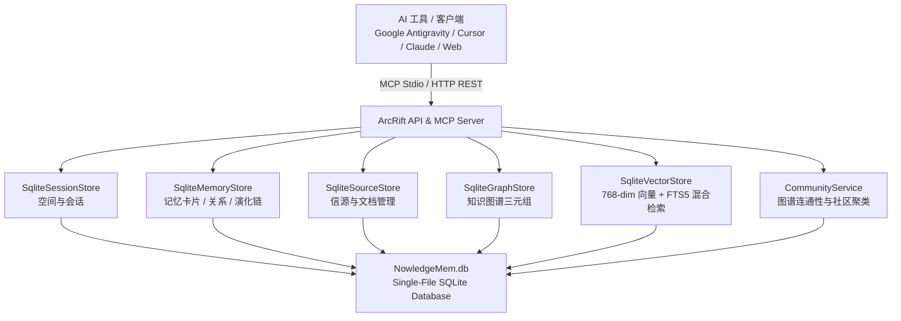

<div align="center">

# ArcRift (Nowledge Mem Pure SQLite) — 本地化 AI 记忆与知识管理系统

### 让 AI 工具不再失忆。跨会话、跨工具的持久记忆与知识图谱引擎。

**一个面向开发者与 AI Agent 的本地优先知识库与长期记忆系统——基于 Pure SQLite 单文件零依赖存储，捕获会话、构建知识图谱、追踪记忆演化，并通过标准 MCP 协议将上下文实时注入每一个新 Prompt。无需 Docker，无需云端，数据完全本地掌控。**

<br/>

[](CHANGELOG.md)
[](LICENSE)
[]()
[]()

<br/>

</div>

---

## 📖 项目简介

本项目基于开源的 **ArcRift** 架构，全面重构对齐 **Nowledge Mem** 的功能体系与协议规范，打造了一套高性能、纯本地、零 Docker 依赖的 AI 知识管理与长期记忆引擎。

### 🌟 核心重构亮点
1. **100% 纯 SQLite 单文件架构 (Zero-Docker)**：
   - 彻底移除了 Neo4j、MongoDB 与 ChromaDB 等臃肿外部依赖。
   - 所有会话数据、记忆单元、知识图谱三元组、向量索引（`sqlite-vec` 768 维余弦相似度）以及 BM25 全文检索（SQLite FTS5）全部收敛至 `<程序根目录>/data/NowledgeMem.db`，读写延迟降低至亚毫秒级（<1ms）。
   - 数据存储路径与盘符解耦，无论安装在 D 盘还是其他目录均自动定位在本地 `./data/` 目录中，杜绝污染系统 C 盘。
2. **完整 Nowledge Mem MCP 工具协议体系**：
   - 实现了包含 `memory_add`、`memory_search`、`memory_relation_add`、`query_sources`、`list_communities`、`memory_evolves_chain`、`get_space_profile` 等在内的 20+ 个标准 MCP 工具，同时 100% 兼容历史别名。
3. **记忆演化与显式关联网 (Memory Relations & Evolution)**：
   - 记忆不再是孤立卡片，支持记忆卡片间的显式语义关联（`supports`, `contradicts`, `depends_on`, `relates_to`, `caused_by`）以及版本迭代淘汰（`memory_supersede` & `memory_evolves_chain`）。
4. **信源与多空间隔离 (Library Sources & Multi-Space)**：
   - 全面支持文档、URL 与代码库的信源生命周期管理与分片翻页检索。
   - 提供严格的 Space 级数据与检索隔离，支持通过空间画像 (`get_space_profile`) 快速掌握项目全貌。

---

## 🚀 核心架构与功能模块



### 1. 🧠 记忆层与演化管理 (Memories & Evolution)
- **Memory Unit Type**：支持 `fact`, `preference`, `decision`, `plan`, `procedure`, `learning`, `context`, `event` 等多维认知类型。
- **Memory Relations**：支持在记忆卡片间建立带置信度与权重的显式关联。
- **Evolution Chain**：支持知识版本演化链路回溯与淘汰更新（`replaces`, `enriches`, `confirms`）。

### 2. 📚 信源资料库 (Source Management)
- 支持本地文件、技术文档、网页 URL 与参考备忘的统一录入与生命周期追踪 (`lifecycle_state`: parsed / indexed / extracted / stale)。
- 支持大文档的分片、偏移量翻页读取（`read_source_content`），适配 LLM 上下文限制。

### 3. 🌐 知识社区聚类 (Communities Discovery)
- 基于知识图谱与实体连通图，自动运行社区聚类算法（Louvain / Connected Components），发掘高内聚的主题知识社区（`list_communities`, `run_community_detection`）。

### 4. 🗂️ 多空间与项目画像 (Multi-Space & Profiles)
- 支持多项目/多空间的物理隔离，数据互不交叉。
- `get_space_profile` 自动聚合项目的记忆数、图谱事实数、信源数、知识社区以及最新的 Working Memory 每日简报。

### 5. 🌲 知识树与项目第一顺位分类体系 (Knowledge Tree & Project 1st Order)
- **🚀 项目第一顺位 (By Project)**：
  - 针对开发者与 Agent 真实 Coding 场景，将「项目 (Projects)」确立为第一顺位组织维度。
  - Agent 在 IDE (Antigravity, Cursor, Claude Code) 中捕获或沉淀记忆时，系统自动识别 Workspace、仓库名或会话标题，将项目标签置顶注入 (`labels[0]`)。
- **5 大记忆核心子维度**：
  - `💡 全部记忆 (All Memories)`：扁平精选流，支持快速抽屉探查。
  - `🚀 按项目 (By Project)`：各 Coding 项目专属卡片流与独立记忆库。
  - `📅 按日期 (By Date)`：内嵌 30 天 5 级活动热力日历，按时间回溯沉淀。
  - `🏷️ 标签 (Tags)`：项目标签置顶高亮 + 概念技术标签 2 列聚合卡片网格。
  - `💎 结晶 (Crystals)`：高重要度（Critical/High）关键架构决策与技术结晶。
  - `💡 按类型 (By Type)`：8 大认知类型（事实、偏好、决策、计划、流程、学习、上下文、事件）分类专页。

### 6. 🤖 智能体会话批量导入管理器 (Smart Agent Importer)
- **本地 Agent 全自动扫描**：自动发现并聚合本地 AI 编程工具（Google Antigravity、Claude Code、Cursor、Codex 等）的任务工作区与多轮会话日志。
- **项目工作区树（Tree List）**：多级展开/折叠、单项/整项目勾选、实时导入状态（`183/` 绿色角标与 `✓ 已导入` 状态徽章）。
- **即时交互预览与导入**：右侧真实渲染 User 与 Assistant 的多轮对话预览，底部提供全选、导出、导入并查看及批量导入。

### 7. 💬 真实多轮对话还原与时间轴悬停目录 (Chat Restoration & Timeline Scrubber)
- **真·多轮对话流**：将 IDE 日志精准拆分为独立的 User 与 Assistant 轮次气泡，支持代码高亮排版、单条消息复制与 `✨ 提炼` 知识。
- **时间轴悬停大纲抽屉 (Hover Timeline Scrubber)**：
  - 聊天区域右侧集成了垂直时间轴刻度导轨；
  - **鼠标悬停刻度时，自动滑出毛玻璃抽屉面板 `📌 对话目录 (N)`**，列出所有对话轮次的核心提要与角色标签；
  - 点击目录中的任意条目，聊天窗口会自动**平滑滚动定位**至对应消息。
- **多选批量管理**：支持一键进入选择模式，提供批量删除、联动清理图谱实体与一键全文向量索引重建。

---

## 🔌 完整 MCP 工具协议清单

ArcRift 内置了完整的 Nowledge Mem 标准 MCP 工具协议：

| 优先级 | 工具名称 | 描述 |
|:---|:---|:---|
| **P0** | `memory_add` | 录入或 Upsert 记忆（支持 labels, unit_type, importance, evolves_from） |
| **P0** | `memory_search` | 混合检索（语义向量 + BM25 FTS5 + 标签/类型过滤） |
| **P0** | `get_memory_by_id` | 按 ID 获取记忆卡片详情与元数据 |
| **P0** | `memory_update` | 局部更新记忆内容、权重或标签 |
| **P0** | `memory_delete` | 按 ID 删除记忆卡片 |
| **P0** | `read_working_memory` | 读取项目工作记忆（每日简报、焦点、决策、阻碍） |
| **P0** | `update_working_memory` | 更新工作记忆状态与焦点 |
| **P0** | `list_spaces` | 列出所有活跃空间/项目及统计指标 |
| **P0** | `explore_graph` | 探索实体与记忆周边的知识图谱子图 |
| **P0** | `graph_stats` | 获取全局空间、记忆、图谱与实体统计信息 |
| **P1** | `memory_relation_add` | 建立记忆间的显式语义关联（supports, contradicts, depends_on 等） |
| **P1** | `memory_relation_list` | 查询记忆关联网络（支持 out / in / both 方向遍历） |
| **P1** | `memory_relation_delete`| 删除指定的记忆显式关联 |
| **P1** | `query_sources` | 检索信源资料库（支持类型、标签与全文过滤） |
| **P1** | `read_source_content` | 分页/偏移量读取信源的原始正文内容 |
| **P2** | `list_communities` | 列出图谱聚类发现的知识社区与主题 |
| **P2** | `run_community_detection`| 运行图谱聚类算法，自动发现新知识社区 |
| **P2** | `get_community_details`| 查看知识社区详情及其关联的所有实体与记忆 |
| **P2** | `memory_evolves_chain` | 获取记忆的版本演化链（双向追溯祖先与后代） |
| **P2** | `memory_supersede` | 将旧记忆淘汰，标记新版本记忆并自动建立演化关联 |
| **P3** | `get_space_profile` | 按 ID/名称/Slug 解析空间画像（统计、资料、工作记忆） |
| **P3** | `mem_fs` | Nowledge FS 虚拟文件系统（支持 `capabilities`, `ls`, `stat` 低开销元数据探测, `cat --line N --lines M` 窗口切片读取, `tree`, `recall`） |
| **P3** | `check_claims` | 交付前只读断言预检（比对废弃/冲突记忆，防止 Agent 产生幻觉与过时输出） |
| **P3** | `list_timeline_reviews` | 查看时间线审议收件箱中的冲突审查事件列表 |
| **P3** | `resolve_timeline_review` | 裁决时间线冲突（keep_newer_as_latest, keep_older_as_latest, keep_both_linked, dismiss） |
| **Compat** | `recall_context` | 编码助手兼容接口：检索相关记忆片段并封装为上下文 |
| **Compat** | `store_memory` / `search_memory` / `prune_memory` / `list_projects` | 历史兼容别名接口 |

---

## 🛠️ 项目目录结构

```
ArcRift/
├── backend/                     # 后端核心服务（Node.js + TypeScript + Express 5）
│   ├── src/
│   │   ├── index.ts             # Express 入口，集成 API 路由与生产前端挂载
│   │   ├── mcp/
│   │   │   ├── server.ts        # 标准 MCP Stdio 服务端（注册 25+ 个工具）
│   │   │   └── tools/           # 标准 MCP 工具实现（mem_fs, check_claims, timeline_reviews 等）
│   │   ├── routes/              # REST 路由（memories, sources, communities, migration, intelligence, etc.）
│   │   ├── services/            # 业务服务层
│   │   │   ├── sqlite.ts        # SQLite 单文件驱动、迁移与 FTS5/Vector 扩展
│   │   │   ├── sqlite-memory.ts # 记忆卡片 CRUD、RRF 混合检索、30天半衰期衰减与演化链
│   │   │   ├── sqlite-source.ts # 信源资料库管理
│   │   │   ├── sqlite-graph.ts  # 知识图谱三元组存储
│   │   │   ├── sqlite-vector.ts # sqlite-vec 向量检索与 FTS5 降级检索
│   │   │   ├── community.ts     # 知识图谱社区聚类引擎
│   │   │   ├── nowledge-fs.ts   # Nowledge FS 虚拟文件系统映射引擎
│   │   │   ├── claims-checker.ts# 断言冲突预检与时间线审议服务
│   │   │   ├── migration.ts     # 数据迁移（JSON 导出与 Merge/Skip/Replace 导入）
│   │   │   ├── storage.ts       # 纯 SQLite 统一数据存储门面
│   │   │   └── storage.types.ts # 核心类型契约
│   │   └── utils/
│   │       ├── paths.ts         # 跨平台数据路径管理器（自动锁定应用根目录 data/）
│   │       └── settings.ts      # 系统设置管理（19家服务商、偏好设置、个人画像、随处访问）
│   └── scripts/                 # 全套自动化集成测试套件（100% 保持通过）
│       ├── test-rrf-decay.ts           # RRF 融合与 30 天半衰期时间衰减测试
│       ├── test-mem-fs.ts              # Nowledge FS 窗口化切片与 stat 探测测试
│       ├── test-claims-reviews.ts      # 断言冲突预检与审议收件箱裁决测试
│       ├── test-mcp-alignment.ts       # MCP 协议基础对齐测试
│       ├── test-p1-relations-sources.ts# 记忆关联与信源管理测试
│       ├── test-p2-communities-evolution.ts # 社区发现与演化链测试
│       ├── test-p3-multispace.ts       # 多空间数据与检索严格隔离测试
│       ├── test-smart-processing.ts    # 智能处理与 Token 预算测试
│       ├── test-providers.ts           # 19家服务商配置与连接性测试
│       ├── test-migration-remote.ts    # 数据迁移与随处访问测试
│       └── test-preferences.ts         # 偏好设置持久化测试
├── dashboard/                   # Web 管理面板 & Tauri 桌面端（React + Vite + Tauri 2）
│   └── src/
│       ├── api/ArcRift.ts       # 前端 API 客户端封装
│       └── components/Nowledge/ # 偏好设置、服务商、智能处理、记忆、信源、图谱、工作记忆等面板
├── data/                        # SQLite 单文件存储目录（NowledgeMem.db）
└── README.md
```

---

## 🚦 快速开始

### 1. 安装依赖与编译
```bash
# 1. 编译后端
cd backend
npm install
npm run build

# 2. 编译前端管理面板
cd ../dashboard
npm install
npm run build
```

### 2. 启动服务
```bash
# 启动后端服务（默认运行在 http://localhost:3000，自动托管前端 Dashboard）
cd backend
npm start
```

### 3. 配置 MCP 客户端（如 Google Antigravity / Cursor / Claude Desktop）
在你的 MCP 配置文件中添加：
```json
{
  "mcpServers": {
    "nowledge-mem": {
      "command": "node",
      "args": ["E:\\Workspace\\AI-Project\\ArcRift\\backend\\dist\\mcp\\server.js"],
      "env": {}
    }
  }
}
```

---

## 🧪 自动化测试与验证

本项目内置了覆盖 P0-P3 所有功能点的回归测试套件，执行以下命令即可一键验证：

```bash
cd backend
npx ts-node scripts/test-mcp-alignment.ts
npx ts-node scripts/test-p1-relations-sources.ts
npx ts-node scripts/test-p2-communities-evolution.ts
npx ts-node scripts/test-p3-multispace.ts
```

**测试结果汇总：**
- ✅ **P0 MCP 对齐**：10 项基础工具协议与 FTS5/BM25 检索测试通过率 100%
- ✅ **P1 记忆关联与信源**：关系增删查、双向遍历、信源切片读取测试通过率 100%
- ✅ **P2 社区聚类与演化**：图谱实体自动聚类、演化链双向回溯与记忆淘汰测试通过率 100%
- ✅ **P3 多空间隔离**：空间画像解析、跨空间数据物理隔离与独立检索测试通过率 100%

---

## 📄 开源许可

本项目基于 [MIT License](LICENSE) 开源。
